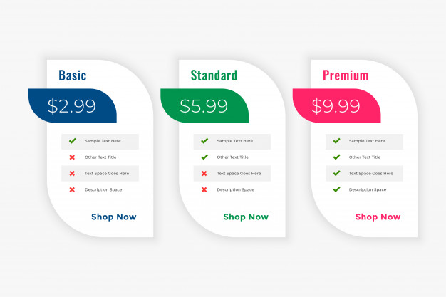
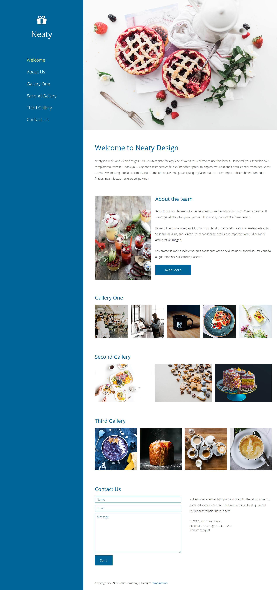

# Task 

Create a static web page using HTML 5 and CSS 3 as per the reference figure given
below. The snapshots are given for reference. The implementation should include the
following.
- Appropriate use of HTML elements and CSS selectors and properties.
- The web font should be integrated.
- The icons should be integrated with icon libraries such as Font Awesome,
Materialize, etc.

## Section Problem Statement Reference Image

### 1.1 Landing Page 

### 1.2 Plan Selection 

### 1.3 Single Page Website 
